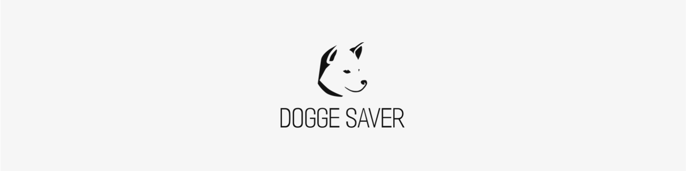

<div id="top"></div>

[![MIT License][license-shield]][license-url]

<a href="https://doggesaver.herokuapp.com/">
  


## About The Project

I created this simple web application in order to vet toxic food ingredients for my pet dog,Benjamin.

#### Table of contents

 <ol>
    <li>
      <a href="#about-the-project">About The Project</a>
      <ul>
        <li><a href="#built-with">Built With</a></li>
      </ul>
    </li>
    <li>
      <a href="#getting-started">Getting Started</a>
      <ul>
        <li><a href="#web-application">Web Application</a></li>
        <li><a href="#installation">Installation</a></li>
      </ul>
    </li>
    <li><a href="#license">License</a></li>
    <li><a href="#contributors">Contributors</a></li>
  </ol>


### Built With

Frameworks & libraries used to create this project.

* [flask](https://flask.palletsprojects.com/en/2.0.x/)
* [gunicorn](https://gunicorn.org)
* [requests](https://docs.python-requests.org/en/latest/)

<p align="right">(<a href="#top">back to top</a>)</p>


## Getting Started
This is how you may run the web application locally.


### Installation

1. Clone the repo:
   ```console
   (base)@Rogers-MacBook-Air % git clone git@github.com:rogerfvieira/dogge.git
   ```
2. Run the virtual environment:
   ```console
   (base)@Rogers-Macbook-Air dogge % pipenv shell
   ```
3. Run flask:
   ```console
   (dogge)(base)@Rogers-Macbook-Air dogge % flask run
   ```
<p align="right">(<a href="#top">back to top</a>)</p>

## Credit
In order to obtain ingredients from the provided upc code I used https://www.upcitemdb.com/api/explorer#!/lookup/get_trial_lookup

<p align="right">(<a href="#top">back to top</a>)</p>

## Demo


## License
Distributed under the MIT License. See `LICENSE` for more information.

<p align="right">(<a href="#top">back to top</a>)</p>

## Contributors

***Roger Vieira***

Github: https://github.com/rogerfvieira

LinkedIn: https://www.linkedin.com/in/rogerfloresvieira/


<p align="right">(<a href="#top">back to top</a>)</p>


[license-shield]: https://img.shields.io/github/license/othneildrew/Best-README-Template.svg?
[license-url]: https://github.com/kik-start/kickstart/blob/main/LICENSE
